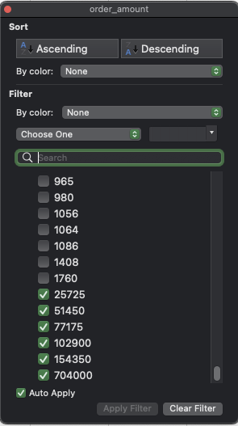
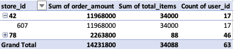
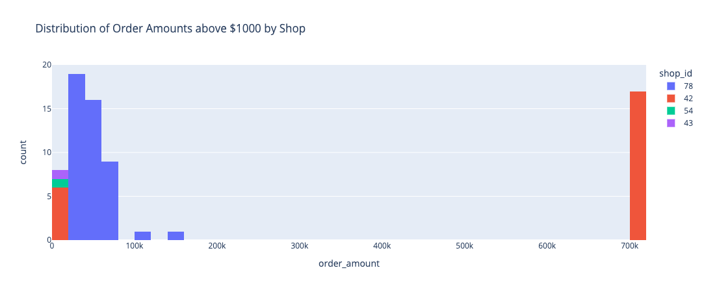

# Shopify Fall 2022 Challenge - Analysis 
By [Jihad Al-Hussain](https://www.github.com/jqh84) - github.com/jqh84

## The Problem 
The problem of this challenge is to find out why we are getting a higher than expected average order value or AOV of $3145.13 when the shopify store data is only selling sneakers which are a relatively low cost item.

Key facts based on the provided problem statement:
1. There are 100 Shops in this database.
2. Each shop has sells only 1 model of shoe. 

## Data Preparation & Processing

### Data Exploration in spreadsheet software ( MS Excel , Google Sheets )

The raw data was downloaded and stored locally for further review. The spreadsheet was reviewed using Excel to have an understanding of the data. below are some insights/verifications of the data:

**Some verifications**

- there were no missing or null values observed.
- there were no duplicate values observed.
- other than the outliers all data points seemed to be in their expected formats i.e there were no negative values and numerics / text data were in their expected respective columns. 
- The data was verified to have only 100 shops with a basic 

**Some insights**
- The average order value of 3145.13 seems to be due to multiple high order transactions above $25000 with the lowest amount next to that being $1760.
- 64 counts on these outlier transactions were found in the dataset with order amounts between $25725 and $704000.

    
- Shop No. 42 seems to the only shop that the large order amount of $704000 was found in and the orders belong to user_id 607. 
- The high value transactions seemed to be from two stores (42 and 78) and total of 46 distinct users id's to have made those transactions.

    
- At this point the data was loaded into Pandas using Python and jupyter notebook to have a more in depth look at the data.

### Data Processing with excel

prior to loading the data into python for further analysis a basic calculation was performed to get the shoe price per each shop they only sell a single model of shoe.

At this stage it was decided to switch to python for further data exploration and insights extraction.

## Data Analysis and Visualization Pandas and Python

The data was loaded as a csv into a pandas dataframe so that it could be easily worked with for plotting and applying more advanced statistical methods. 

Since we identified that the outlier transactions are coming from multiple users and two distinct stores, It is worth investigating further by constructing some visuals using Python (PyViz).

Here we see the store with order amounts above $1000 and less than $700000 which were Store 78 , 42 , 54 and 43.



Another view is to see the distribution of order amounts and average price per shoe by shop as below. (Note the Y axis is in Log Scale to visualize the data in a more meaningful way).

What we can take away from this is that shop 42 had a higher price per shoe compared to the other shop but not shop 78, and shop 78 slightly less in terms of average order amounts on this 30 day period contained in the dataset. 


## Conclusion 

- if we assume there is no issues in the order amount values then a simple average is not the best way to measure the AOV. Since this data is not normally distributed , we could remove out the outliers or use a mean of medians per store. 
- Other metrics that could be measured for this data set can be :
    - Sales/Revenue per store: This can also be broken down by weekly revenue.
    - User Spend per store : this can give insight into which store and there which model shoe is the best overall. 
    - User purchase patterns can be deduced to see if any improvement can be made.

here is an example of a weekly revenue per top 10 stores .

| Shop ID 	| Sum of Order Amounts in $ 	| Total Items 	|
|:---------:|:-----------------------------:|:-------------:|
|    42   	|       11990176       	        |    34063    	|
|    78   	|        2263800       	        |      88     	|
|    89   	|         23128        	        |     118     	|
|    81   	|         22656        	        |     128     	|
|    6    	|         22627        	        |     121     	|
|    13   	|         21760        	        |     136     	|
|    59   	|         21538        	        |     121     	|
|    71   	|         21320        	        |     130     	|
|    19   	|         20538        	        |     126     	|
|    70   	|         20241        	        |     117     	|

here is the example of the top 10 users by purchase amount excluding user 607.


-----------------------------------------------------------------------------------------------------------------------
-----------------------------------------------------------------------------------------------------------------------
QUESTION 2 :

1. How many orders were shipped by Speedy Express in total? 

Since we can see the SpeedyExpress is shipperID 1 we can write the following Query to get the total number of orders shipped by Speedy Express.

```
SELECT 
  Count(OrderID) as Total_Orders_SpeedyExpress 
FROM 
  Orders 
WHERE 
  ShipperID = 1;
```
or if the shipperID may change at a later time we can use 

```
SELECT 
  Count(OrderID) as Total_Orders_SpeedyExpress 
FROM 
  Orders as o 
  JOIN Shippers as s ON o.ShipperID = s.ShipperID 
WHERE 
  s.ShipperName = 'Speedy Express';
```

**Answer :  Peacock , with Total Orders of 40**

-----------------------------------------------------------------------------------------------------------------------
2. What is the last name of the employee with the most orders? 

The orders table contains the employee ID which can be linked to the employees table to get the last name of the employee. and a group and order by function to filter and sort to our desired result.
we limit to 1 combined with a Descending order to get the top result.

```
SELECT 
  e.LastName as LastName, 
  Count(OrderID) as Total_Orders 
FROM 
  Orders as o 
  JOIN Employees as e ON o.EmployeeID = e.EmployeeID 
GROUP BY 
  e.LastName 
ORDER BY 
  Count(OrderID) DESC 
LIMIT 
  1;

```
**Answer :  Peacock , with Total Orders of 40**

-----------------------------------------------------------------------------------------------------------------------
3. What product was ordered the most by customers in Germany?

Here we can user the same orders table and the customers filtered by country to get the result. But to get the product info we need two more tables to join on , the products table and the order details table.

```
SELECT 
  p.ProductName as ProductName, 
  Count(*) as Total_Orders 
FROM 
  Orders as o 
  JOIN Customers as c ON o.CustomerID = c.CustomerID 
  JOIN OrderDetails as od ON o.OrderID = od.OrderID 
  JOIN Products as p ON od.ProductID = p.ProductID 
WHERE 
  c.Country = 'Germany' 
GROUP BY 
  p.ProductName 
ORDER BY 
  Count(*) DESC 
LIMIT 
  1;
```
**Answer :  Gorgonzola Telino , with Total Orders of 5**
